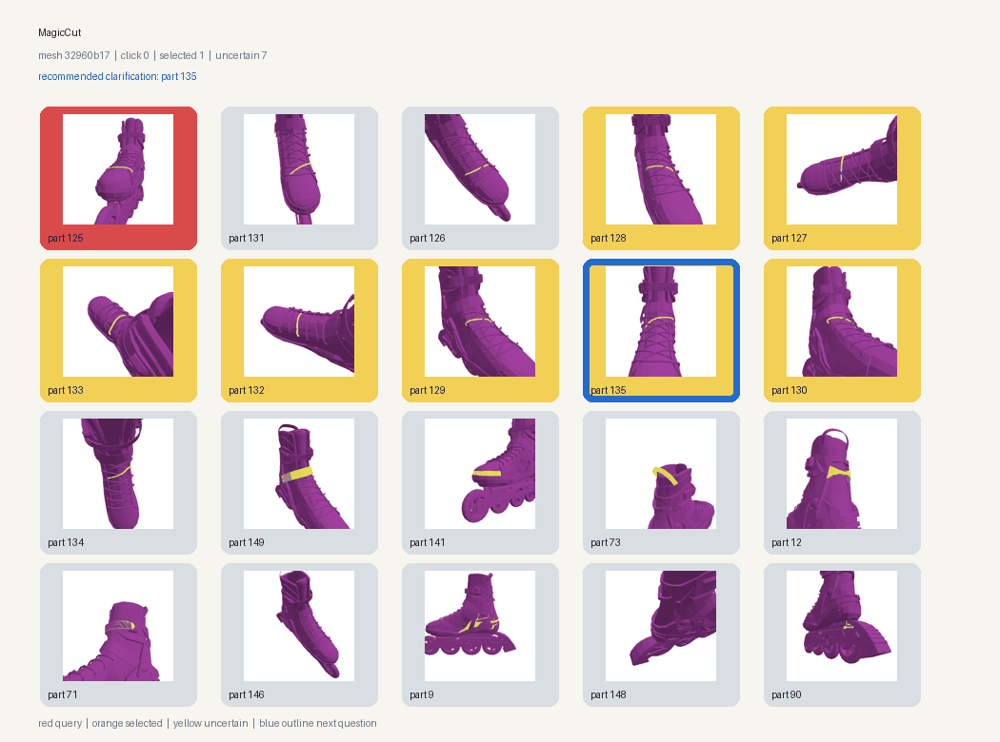
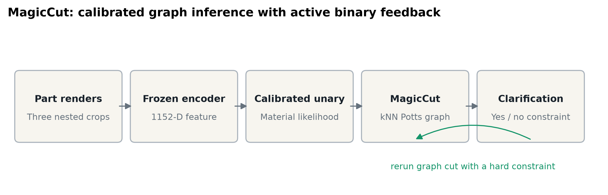
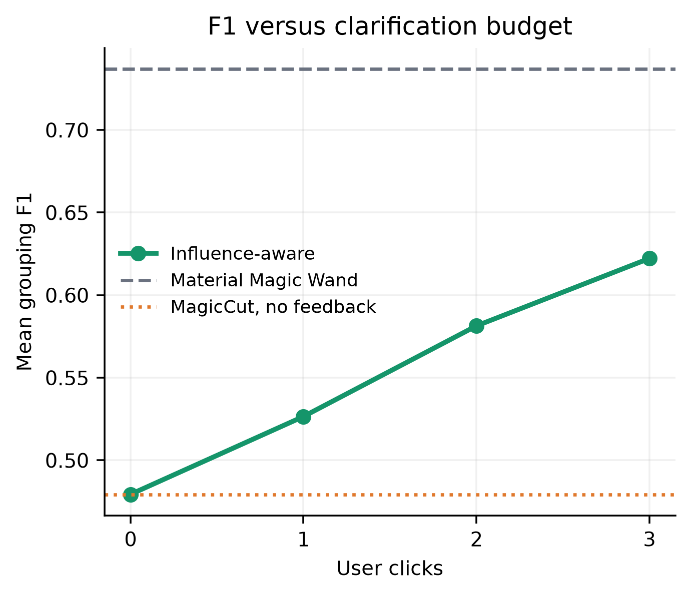
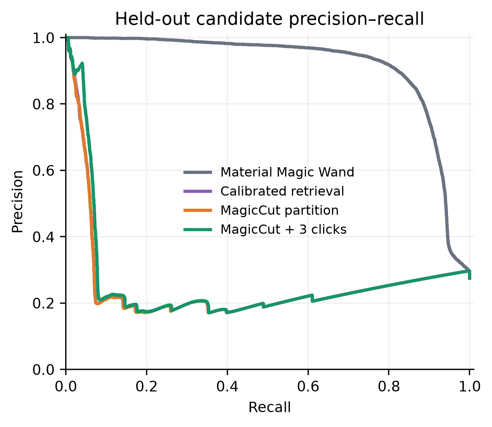
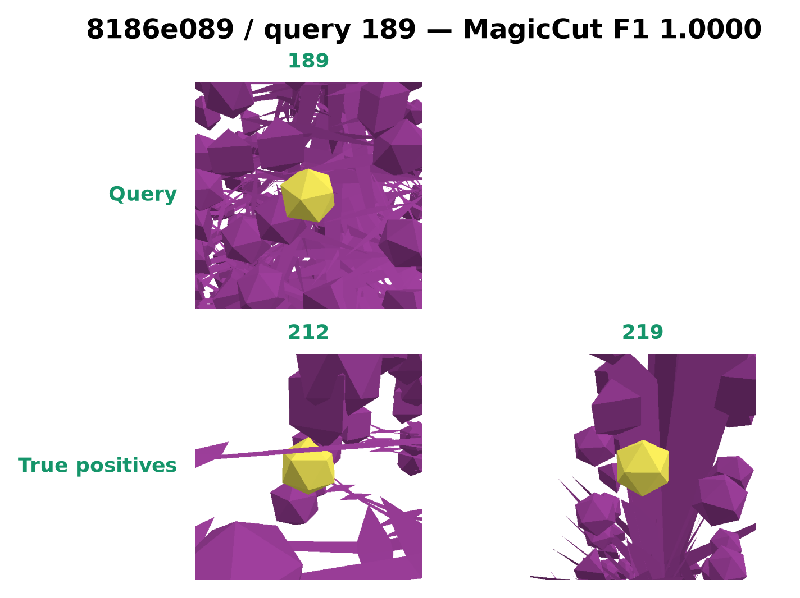
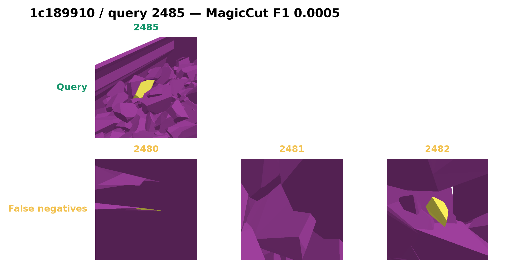

# MagicCut

An interactive computer vision project for grouping parts of a 3D object that should share the same material.



## Why this problem matters

A detailed 3D model can contain hundreds or thousands of separate parts. Before adding colour and texture, an artist may need to identify every part that should be made of the same material. Selecting those parts one at a time is slow and mistakes are easy to make.

[Material Magic Wand](https://arxiv.org/abs/2603.17370) approaches this as a visual retrieval problem. The artist clicks one part, the model compares it with every other part in the object, and similar parts are selected automatically.

The difficult cases are not always solved by visual similarity alone. Two parts can look alike but need different materials. A matching set can also contain pieces with different shapes or positions. MagicCut explores whether relationships between parts and a few yes or no corrections can make that grouping process more reliable.

## What I built

I started from the public Material Magic Wand model and benchmark, then built a complete evaluation and interaction pipeline around it:

1. Audited the released model checkpoint, benchmark metadata, and 100 mesh archives.
2. Extracted and verified 25,348 part embeddings from three render contexts per part.
3. Reproduced the paper's distance-based material grouping baseline.
4. Converted similarity scores into calibrated probabilities.
5. Built a nearest-neighbour graph and used graph cut inference to group related parts.
6. Added an active clarification policy that chooses the most useful part to ask about next.
7. Built an interactive demo that updates the group after positive or negative feedback.
8. Froze every parameter before running the final 94-mesh test split.

The project combines computer vision, graph algorithms, uncertainty estimation, active interaction, statistical evaluation, and reproducible ML engineering. The released encoder remains frozen, so the experiment measures the value of the new inference and feedback system rather than additional model training.

## How MagicCut works



Each mesh is already divided into parts. The user selects one query part, shown in red in the demo.

1. A frozen DINO-v3-small vision encoder represents each part using isolated, contextual, and full-object renders.
2. A calibration model estimates how likely every candidate is to belong with the query.
3. A graph connects visually related parts and a graph cut produces the initial group.
4. Uncertain parts are shown in yellow.
5. The system recommends one clarification, outlined in blue.
6. A yes or no answer becomes a hard constraint and the graph is solved again.

This interaction can repeat for up to three corrections. Selected parts are orange and rejected parts remain grey.

## Research question

The main question was simple: can graph structure improve one-click material grouping, and can one to three targeted corrections recover difficult cases?

All graph parameters, thresholds, calibration settings, and interaction weights were chosen using six validation meshes. The remaining 94 meshes were held out until the configuration was frozen.

## Results

The final test contains 230 grouping queries across 94 held-out meshes.

| Method | Precision | Recall | F1 | Inference ms |
|---|---:|---:|---:|---:|
| Material Magic Wand | 0.7275 | 0.8828 | 0.7368 | 0.0431 |
| Adaptive threshold | 0.9138 | 0.4706 | 0.5204 | 1073.7529 |
| Calibrated retrieval | 0.9138 | 0.4881 | 0.5060 | 0.0615 |
| MagicCut (0 clicks) | 0.9489 | 0.4398 | 0.4794 | 4.3429 |
| MagicCut (1 click) | 0.9571 | 0.4800 | 0.5265 | 3.1389 |
| MagicCut (2 clicks) | 0.9641 | 0.5329 | 0.5814 | 3.1965 |
| MagicCut (3 clicks) | 0.9674 | 0.5737 | 0.6222 | 3.3627 |

The original Material Magic Wand threshold remained the strongest method overall. MagicCut reached F1 0.4794 without feedback, compared with 0.7368 for the baseline. Three targeted corrections raised MagicCut to 0.6222, recovering part of the loss but not reaching the baseline.

The paired difference after three corrections was -0.1146 [-0.1812, -0.0551]. Its 95% mesh-bootstrap interval stayed below zero, so the final experiment does not support a claim that MagicCut outperforms Material Magic Wand.



The graph performed well on the validation meshes, then became too conservative on larger unseen meshes. I kept and analyzed that regression because it revealed where the approach breaks. The experiment also showed that explicit feedback consistently repaired some graph errors, with a mean F1 gain of 0.1428 [0.1195, 0.1664] over zero-click MagicCut.

## Interactive demo

The demo lets a user choose a mesh and query part, inspect the predicted group, answer the recommended yes or no question, and watch the grouping update.

```bash
uv sync --frozen --extra dev
uv run python scripts/serve_demo.py
```

Open `http://127.0.0.1:8000` after the server starts.

The evaluation uses benchmark labels to simulate answers. The interface itself accepts real user input, but this project does not claim results from a human user study.

## Repository guide

| Path | Purpose |
|---|---|
| `src/magiccut/` | Core calibration, graph inference, uncertainty, and feedback code |
| `demo/` | Browser interface for interactive grouping |
| `scripts/` | Data audits, embedding extraction, experiments, figures, and demo server |
| `tests/` | Unit and HTTP integration tests |
| `reports/generated/` | Frozen configurations, metrics, statistical analysis, and figures |
| `docs/research_writeup.md` | Full research report and limitations |
| `docs/technical_summary.md` | One-page technical summary |

## Run the project

Requirements: Python 3.10 or newer and [uv](https://docs.astral.sh/uv/). Dependencies are pinned in `uv.lock`.

```bash
uv sync --frozen --extra dev
uv run pytest -q
```

Download and verify the public checkpoint and benchmark metadata:

```bash
uv run python scripts/audit_resources.py --download-checkpoint
uv run python scripts/audit_benchmark.py --download-metadata
uv run python scripts/prepare_benchmark.py
```

Extract embeddings and reproduce the final analysis:

```bash
uv run python scripts/extract_embeddings.py
uv run python scripts/evaluate_locked.py
uv run python scripts/analyze_statistics.py
uv run python scripts/generate_figures.py
uv run python scripts/audit_project.py
```

The evaluation script refuses to overwrite an existing final result. This prevents accidental test-set tuning. Large datasets, checkpoints, and embedding caches are intentionally excluded from Git.

To verify the repository from a clean temporary environment:

```bash
make clean-check
```

The clean check installs only from the lockfile, runs all unit and integration tests, and audits the Git payload for accidental large files.

## Evaluation details

- Dataset: 100 meshes, 241 queries, and 25,348 representative parts
- Split: 6 validation meshes and 94 held-out meshes
- Metrics: macro precision, recall, F1, retrieval mAP, and risk coverage
- Statistics: 5,000 bootstrap samples grouped by mesh
- Reproducibility: archive hashes, feature shapes, IDs, finite values, and cache hashes are checked
- Testing: 24 unit and integration tests, plus a clean-environment installation test



## Failure analysis

The best graph-cut improvement and the largest regression are shown below. Both examples were selected automatically from the held-out results using the change in F1, not by manual cherry-picking.





Performance dropped most sharply on large meshes. Graph smoothing sometimes connected visually similar parts that had different material labels, while conservative unary probabilities missed small or disconnected positive groups. Positive and negative feedback helped correct these cases but three answers were not enough to eliminate the gap.

## Limitations

- Feedback labels are simulated from benchmark ground truth, not collected from 3D artists.
- The public release does not include the authors' full inference implementation, so preprocessing was reconstructed and audited from the paper, checkpoint, and released data.
- The six validation meshes used here are not presented as the paper's private validation split.
- The released images provide three contexts from one camera, not independent camera views.
- Results come from one benchmark and do not establish performance on other 3D datasets.

## License

The original MagicCut source code is available under the [MIT License](LICENSE). Material Magic Wand, GaussianCut, the released checkpoint, and the benchmark are third-party resources and remain subject to their original licenses and terms. The checkpoint and full benchmark archives are downloaded separately and are not redistributed in this repository.

## References

- [Material Magic Wand paper](https://arxiv.org/abs/2603.17370), [project page](https://umangi-jain.github.io/material-magic-wand/), [benchmark](https://huggingface.co/datasets/umangijain/material-magic-wand), and [checkpoint](https://huggingface.co/umangijain/material-magic-wand)
- [GaussianCut paper](https://arxiv.org/abs/2411.07555) and [code](https://github.com/umangi-jain/gaussiancut)

For the complete methodology and statistical analysis, see the [research write-up](docs/research_writeup.md).
